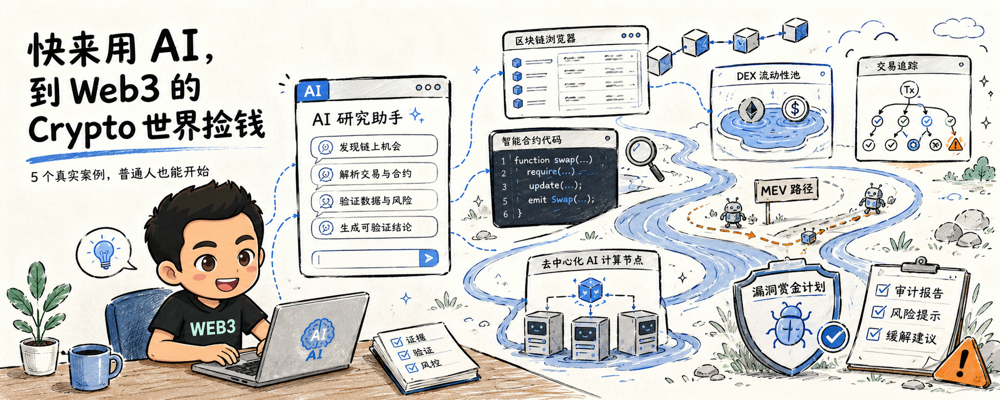
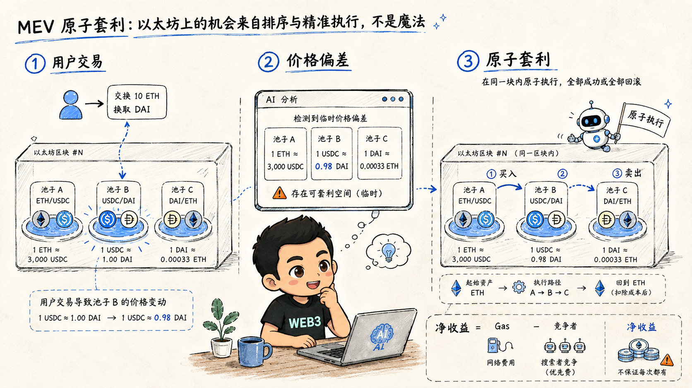
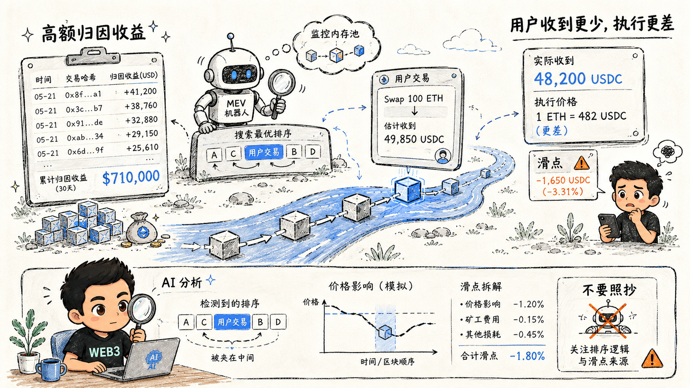
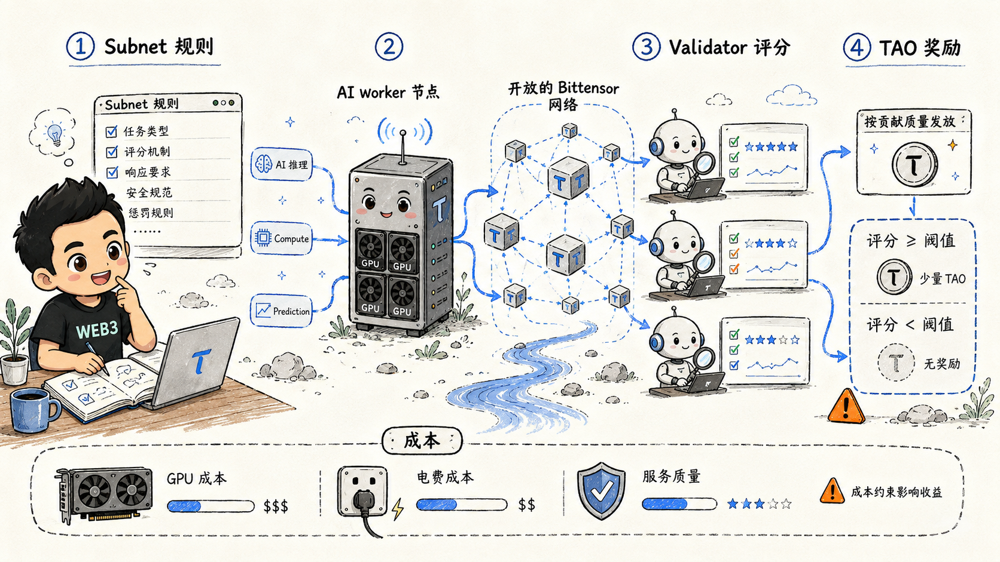

# 快来用 AI，到 Web3 的 Crypto 世界捡钱

【图片占位 IMG-00：封面，请替换为 `00-cover.png`】

先把标题翻译成人话：不是让你拿 AI 猜下一个百倍币，而是让 AI 帮你在公开、复杂、变化很快的 Crypto 市场里，找到别人看不完、算不动、来不及处理的信息差。

「捡钱」只是比喻。真正的利润，通常来自三件事：有人愿意付费的计算资源、市场参与者留下的价格错位，以及协议为了安全而悬赏的漏洞。

AI 不会凭空制造收益。它真正厉害的地方，是把一个普通人的研究半径，从几个网页和几个交易对，扩展到数百个协议、地址、池子和事件。

下面列 5 个已经发生过的真实案例。先说证据，再说普通人能从中学什么。

## 01　MEV：机器人在链上捡到的不是魔法，是顺序差

Flashbots 研究了 Ethereum 上的 MEV-Blocker 和 MEV-Share。自 2023 年 5 月上线以来，52 个原子套利搜索者在 MEV-Blocker 上完成超过 15,000 次 backrun，合计获得 207 ETH；MEV-Share 上则有 38 个搜索者通过约 2,700 次 backrun 获得 63 ETH。[1]

这是可以从链上数据还原的真实搜索者收益，不是交易所截图，也不是回测曲线。

但同一份研究也给了一个不太适合营销的细节：套利竞争越激烈，搜索者利润率越接近 0。赚到钱的不是「发现了一个价差」的人，而是能够更快读状态、更准确估算 Gas、更可靠地把交易打进区块的人。[1]

AI 在这里能做什么？

- 持续读取多个 DEX 的池子状态；
- 找出三角路径和跨池价格偏差；
- 计算手续费、Gas、滑点和失败成本；
- 把可疑机会先做模拟，而不是直接签名；
- 从大量失败交易中总结，哪些信号只是噪声。

普通人不需要第一天就部署 MEV Bot。你可以先让 AI 解释一笔真实交易：谁买了什么，哪个池子的价格被推歪，套利者支付了多少 Gas，最后净剩多少。

这一步已经是在进入 Web3，而不是在看 Crypto 新闻。

【图片占位 IMG-01：MEV 原子套利，请替换为 `mev.png`】

## 02　Base 上一次成功套利只赚 0.12 美元

Flashbots 还拆解过 Base 上的一笔真实成功套利交易：机器人赚了 0.12 美元，支付了 0.02 美元费用。[2]

听起来很寒酸，但它揭示了自动化交易的真实样子：为了找到一次成功机会，这个机器人平均发送约 350 笔失败尝试；每次成功套利背后，平均消耗约 1.32 亿 Gas。[2]

这就是 AI 最容易被误解的地方。

AI 可以让你同时观察更多池子，也可以帮你写出查询价格的脚本。但「观察到更多」不等于「赚得更多」。当一个策略的单次毛利只有 0.12 美元时，延迟、Gas、失败交易和竞争对手，任何一个数字估错，净利润都会消失。

这个案例对普通人的价值，甚至不在于复制它，而在于学会问：

> 屏幕上的价差，扣完所有成本之后，还剩多少？

如果你不能回答，看到的就只是毛利润，不是机会。

## 03　MEV 机器人可以赚很多，也可以把别人变成成本

2023 年 4 月，公开链上分析显示，Ethereum 上一个以 `jaredfromsubway.eth` 关联的 MEV 机器人，在一天内从大量交易中获得超过 710,000 美元利润，前一天也曾获得约 950,000 美元。[5]

这里必须把话说完整：这类数据来自公开链上分析，金额是研究者对地址和交易的归因，不是我的收益证明；其中相当部分与 sandwich 等会恶化普通用户成交价格的策略有关。[5]

我不把这种模式包装成「普通人应该照抄的财富密码」。它更像一堂昂贵的市场结构课：

- 区块链的交易排序本身可以产生价值；
- 机器人的速度和规模远超人工操作；
- 一方的利润，可能就是另一方多付的滑点和 Gas；
- 看到成功地址，不等于看到了它的服务器、私有订单流、失败成本和法律风险。

AI 可以帮助普通人识别自己正在被什么机制收费。把一笔交易交给 AI，要求它逐项标出价格影响、交易前后余额变化、优先费和可能的 MEV，而不是只问「这币会不会涨」。

先学会不当燃料，再谈怎么找机会。

【图片占位 IMG-02：MEV 的双面性，请替换为 `research.png`】

## 04　Bittensor：你可以卖 AI 能力，而不只是买 Token

Bittensor 的模式很直接：不同 Subnet 生产计算、推理、存储或预测等数字商品；Miner 提供服务，Validator 评价服务质量，网络按照贡献分配 TAO。[3]

这不是「AI 概念币」的宣传口号，而是一套真实运行的参与者结构。

它给普通人打开了另一条路：Web3 的收入机会不一定来自预测价格，也可能来自提供有用的 AI 产能。

例如，一个人可以研究某个 Subnet 的任务规则，使用 AI 帮自己理解代码和激励机制，再决定是否提供推理、数据处理或其他可验证服务。AI 可以帮你：

- 阅读几十页英文文档并提炼参与条件；
- 对照 Miner 和 Validator 的代码，找出评分逻辑；
- 估算 GPU、电费、服务器和 Token 波动后的盈亏平衡点；
- 记录每次提交的结果，判断奖励是否来自真实贡献。

这里依然没有「开台机器就躺赚」。如果你的服务质量低、成本高，或者激励机制发生变化，奖励可以迅速归零。

但这件事的意义很大：一个没有金融背景的人，也可以把自己的计算资源、工程能力或数据能力直接放进开放网络里定价。

【图片占位 IMG-03：Bittensor AI 贡献网络，请替换为 `bittensor.png`】

## 05　漏洞赏金：AI 帮你找问题，协议用真钱奖励白帽子

Immunefi 目前公开展示的生态数据包括 83,000 多名注册安全研究员、超过 1,600 个已发现的主网高危漏洞，以及超过 1.25 亿美元的漏洞赏金支付；其中 Wormhole 曾支付创纪录的 1,000 万美元赏金，并在同一天完成验证和修复，最终没有资金损失。[4]

这是真正意义上的「用能力换 Crypto 收入」。不过，漏洞赏金不是让你攻击陌生合约，更不是把漏洞利用代码发到公开网络。正确路径是：明确项目范围，做授权内研究，提交可复现报告，让项目先修复，再按规则领取赏金。

Immunefi 也明确把 AI-augmented researchers 放进它的研究流程里。[4]

- 读懂陌生 Solidity 合约；
- 把复杂的资金流画出来；
- 生成边界条件和状态转换清单；
- 帮你写最小化测试，检查重入、权限和会计错误；
- 将发现整理成项目方能复现的报告。

但 AI 不能替你证明漏洞真的存在。安全研究最重要的部分仍然是：理解资产在哪里、攻击者能做什么、影响金额如何计算，以及报告是否在授权范围内。

这是普通人进入 Web3 最值得考虑的一条路线，因为它不要求你先押注某个 Token。你卖的是发现问题和保护资产的能力。

## AI 为什么会改变普通人进入 Web3 的门槛

以前进入 Crypto，至少要同时会一点：

- 英文技术阅读；
- 区块链浏览器；
- Solidity 和 ABI；
- DEX 定价；
- Gas、滑点和交易排序；
- 服务器与密钥安全。

现在，AI 可以把这些知识之间的翻译成本大幅压低。

你可以让它把一笔十几跳的交易翻译成人话，让它比较两个池子的实际可成交价格，让它根据 ABI 生成只读查询，让它把一份英文审计报告转换成检查清单。

这不代表 AI 替你承担风险。恰恰相反，AI 越强，你越应该要求它留下证据：区块号、交易哈希、合约地址、输入金额、费用、失败原因和数据来源。

没有证据的 AI 分析，只是更快生成的幻觉。

## 我会怎么开始：先捡信息，再碰资金

第一步，只做只读研究。

让 AI 每天找一个真实案例，输出交易路径、资金流和证据链接。不要买币，不要授权合约，不要连接热钱包。

第二步，做历史复盘。

给它一笔已经发生的套利或清算交易，要求它重算：理论毛利、Gas、协议费、滑点，以及如果晚一个区块会发生什么。

第三步，做模拟。

使用公开报价或本地 fork，设定最大亏损和停止条件。先验证「如果成交」，再验证「实际上能不能成交」。

第四步，才考虑极小额度的真实执行。

所有自动化工具都关闭提币权限，使用独立钱包和小额资金。跨链交易还要额外考虑消息延迟、单腿成交、桥接失败和再平衡成本。跨链不是一个能同时回滚两条链的原子交易。

## 最后一句可能有点扫兴

Crypto 世界确实存在真实的价值错配，也确实有人通过套利、计算资源和漏洞赏金赚到真钱。

但网上最常见的骗局，是把别人的链上收益、历史最高价或模拟结果，剪辑成「你今天就能复制」的教程。

AI 给普通人的最大优势，不是预测未来，而是把复杂世界变得可以检查：

哪里有机会，哪里只是屏幕价差；

哪里是理论毛利，哪里才是保守净收益；

哪里可以只读验证，哪里一签名就可能丢钱。

所以，快来用 AI 到 Web3 的 Crypto 世界「捡钱」。

但先捡这些东西：公开数据、真实证据、可复用的方法，以及在机会失效时及时退出的能力。

## 风险提示

本文是基于公开资料的研究性文章，不构成投资、交易、税务或安全建议。文中案例不是作者本人收益，也不代表未来可以复制。Crypto 资产可能剧烈波动并归零；套利可能因 Gas、滑点、延迟、流动性、MEV、交易失败或单腿成交而亏损；漏洞研究必须严格遵守项目规则和适用法律。任何 AI 输出都必须由人核验，永远不要向 AI 输入私钥、助记词或 API 密钥。

## Sources

[1] https://writings.flashbots.net/illuminate-the-order-flow — Flashbots: Illuminating Ethereum Order Flow
[2] https://writings.flashbots.net/mev-and-the-limits-of-scaling — Flashbots: MEV and the Limits of Scaling
[3] https://docs.bittensor.com/miners — Bittensor: Mining
[4] https://immunefi.com/bug-bounty-program — Immunefi: Bug Bounty Program
[5] https://info.arkm.com/research/beginners-guide-to-mev — Arkham: MEV Guide
