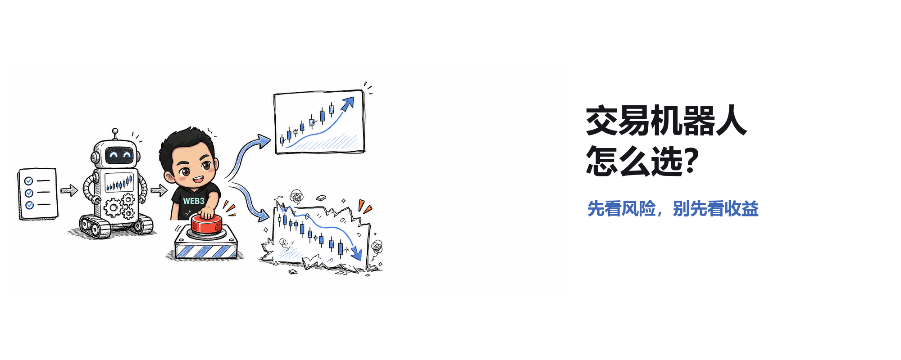
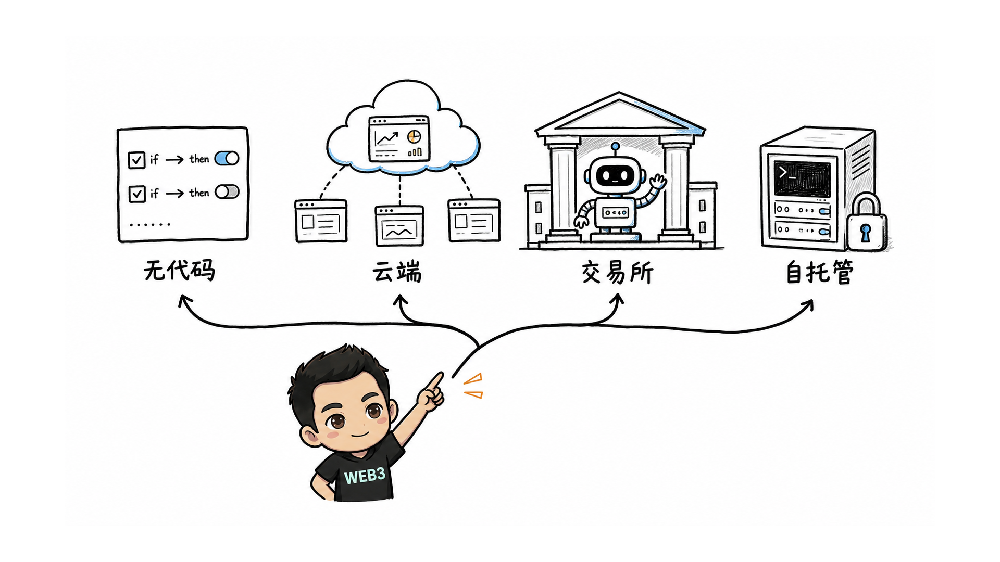
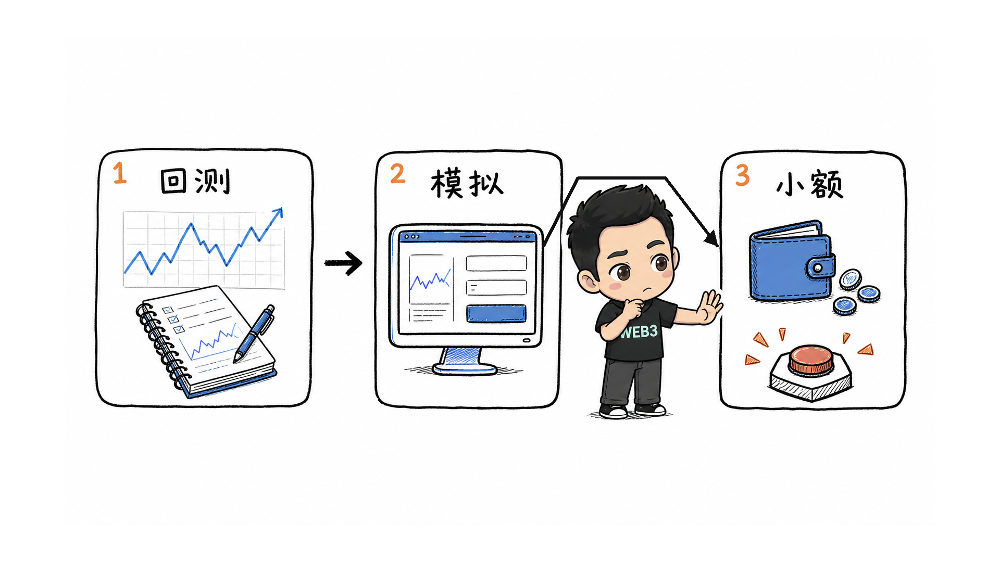

# 2026 加密交易机器人怎么选：别先看「最赚钱」，先看你把什么风险交给了代码

加密市场全天运转，交易机器人最诱人的卖点也很直接：人会睡觉，代码不会。

但「能自动下单」和「能稳定赚钱」是两回事。机器人只会更快、更持续地执行规则。规则错了，它也会更快、更持续地亏钱。

我参考了 Koinly 在 2026 年 7 月更新的 10 款工具清单，重新按使用场景、控制权和风险边界做了一次整理。这不是收益排名，也不是实盘推荐。下文涉及的支持平台、功能和价格主要来自 Koinly 的公开汇总，可能随时变化，付费或入金前应回到各产品官网复核。

## 先把「机器人」拆成四类

很多榜单把所有产品放在一起比较，结果看起来热闹，实际很难选。更有效的方式是先确定自己需要哪一类工具。

【图片占位 IMG-01：四类交易机器人，请替换为 01-four-bot-types.png】

### 1. 无代码规则自动化

Coinrule、CryptoHero 更接近「如果发生 A，就执行 B」的策略搭建器。它们适合第一次接触自动交易、暂时不想写代码的人。

优势是上手快，也常带回测或模拟交易。代价是策略表达能力受平台限制。界面越简单，越要确认平台替你隐藏了哪些假设，例如成交价、滑点、手续费和订单失败后的处理方式。

### 2. 托管式多交易所终端

3Commas、Cryptohopper、Altrady、Mizar 把多个交易所、策略模板、信号和自动执行放到一个界面里。

这类产品省掉了运维，但你需要把交易权限交给第三方服务。它们适合已经知道自己要运行什么策略，只是不想维护服务器和连接器的人。

平台支持多少家交易所并不是最重要的指标。真正需要核对的是：你使用的具体交易对、现货或合约市场、订单类型和所在地区是否都受支持。

### 3. 交易所内置机器人

Pionex 把网格、DCA、再平衡等机器人直接放在交易所里。Koinly 将它列为免费使用内置机器人的选项，但「机器人免费」不等于交易免费，手续费、点差、资金费率和滑点仍会发生。

它省去了外部 API 连接，也把执行和资产集中在同一平台。便利性提高了，交易所集中风险也更高。

### 4. 自托管与开发者工具

Hummingbot、Gunbot、HaasOnline 更偏向愿意自己控制运行环境的用户。

Hummingbot 是开源工具，重点覆盖做市、套利和流动性策略。Gunbot 允许本地运行并支持自定义策略。HaasOnline 同时提供桌面和云端方案。它们给你的控制权更多，也把监控、升级、密钥管理和 24 小时在线的责任交还给你。

自托管并不自动等于安全。密钥留在本机只是减少了一类第三方托管风险；主机被入侵、日志泄漏、依赖被污染或服务器掉线，仍然可能造成损失。

## 10 款工具，应该按什么场景看

根据 Koinly 的公开清单，可以先这样缩小范围：

- 想用无代码规则开始：Coinrule、CryptoHero。
- 想统一管理多个交易所：3Commas、Cryptohopper、Altrady、Mizar。
- 想直接使用交易所内置网格或 DCA：Pionex。
- 想研究做市、套利或自行开发：Hummingbot。
- 想本地运行并保留更多控制权：Gunbot、HaasOnline。

这只是入口，不是结论。Koinly 说明其清单不是从最好到最差排序，而是用流量作为受欢迎程度的代理指标。流量能说明知名度，不能证明策略质量、安全性或未来收益。

## 我会先检查这六件事

### 策略是否能被一句话解释

如果无法说清机器人在什么条件下买、什么条件下卖、什么时候停止，就不应该让它接触真钱。

「AI 会自动适应市场」也不算可验证的策略描述。需要继续追问：它使用什么输入，优化什么目标，在什么条件下会失效？

### 回测有没有算进真实摩擦

漂亮的历史曲线可能漏掉手续费、滑点、资金费率、延迟和无法成交的订单。网格策略还可能在单边下跌中不断接货；套利策略可能看到价差，却无法按屏幕价格同时完成两腿。

回测只能证明一套规则在一段历史数据和一组假设下的表现。它不能证明未来仍有相同的波动结构、流动性和成交条件。

### API 权限是否最小化

机器人通常需要读取账户并下单，但不需要提币权限。Cryptohopper 的安全指南也把权限风险分为只读、交易和提币三个层级，并建议关闭提币权限、按用途分配权限、在可行时设置 IP 白名单。

我的最低线是：

- 提币权限关闭；
- 每个机器人使用独立 API Key；
- 能设置 IP 白名单就设置；
- 启用 2FA 和异常活动提醒；
- 准备好立即撤销和轮换密钥的办法。

### 是否支持模拟和小额上线

先回测，再模拟，最后才是小额实盘。三个阶段分别暴露不同问题：历史假设、实时信号和真实成交。

【图片占位 IMG-02：回测、模拟、小额实盘三道闸门，请替换为 02-three-safety-gates.png】

小额上线时还要设置停止条件，例如连续亏损、累计回撤、接口错误、滑点异常或数据源中断。没有停止条件的自动化，不是自动交易系统，只是无人值守的风险放大器。

### 费用是否超过策略优势

订阅费只是最显眼的一项。完整成本还包括交易手续费、买卖价差、滑点、资金费率、链上 Gas、服务器、数据源和税务记录成本。

如果策略的预期优势只有几个基点，任何一项被低估都可能把理论毛利润变成保守净亏损。

### 税务和记录能否还原

机器人可能在短时间内产生数百或数千笔交易。应确认平台能否导出完整订单、成交、手续费和转账记录，并保留统一时区与稳定的交易 ID。

Koinly 原文自然会强调加密税务工具，但它指出的问题成立：自动化提高了交易频率，也提高了记录和申报的复杂度。

## 对套利用户，榜单还缺了几项关键问题

看到「支持套利」三个字，还不能判断机会是否可执行。至少要继续检查：

- 价差来自哪里，是否只是不同平台的屏幕报价；
- 两条腿能否同时成交，失败后如何处理裸露仓位；
- 可成交深度是否覆盖计划规模；
- 手续费、Gas、滑点、资金费率和再平衡成本是否全部计入；
- 报价多久过期，延迟和 MEV 会如何改变结果；
- 跨链路径是否需要等待消息确认，资金是否已预置在两端；
- 最坏情况下，停止机器人和恢复仓位要花多少钱。

跨链尤其不能被当成单链原子交易。源链与目标链是独立状态机，一条链无法回滚另一条已经确认的交易。协议可以用锁定、退款或经济补偿降低风险，但这不等于两条链拥有同步、全局的原子回滚。

## 一个更懒、也更安全的选择顺序

不要一开始比较 10 个产品的全部功能。先回答三个问题：

1. 我是在执行 DCA、网格、信号交易、做市，还是套利？
2. 我愿意把交易权限交给云平台，还是愿意自己维护运行环境？
3. 我能承受的最大损失和停止条件是什么？

答案会快速排除大部分选项。之后只选两款进入纸上测试，用同一策略、同一市场和同一费用假设比较。胜出的也不要直接重仓，先以小额实盘验证订单、日志、告警和退出流程。

机器人不会替你找到优势。它只会把你已有的优势或错误自动化。

## 来源与边界

- Koinly，《10 Best Crypto Trading Bots (2026)》，更新于 2026 年 7 月 1 日：https://koinly.io/blog/best-crypto-trading-bots/
- Cryptohopper，《How to Secure API Keys Before You Connect a Bot to Your Crypto Exchange》：https://www.cryptohopper.com/blog/how-to-secure-api-keys-before-you-connect-a-bot-to-your-crypto-exchange-13183
- 3Commas，《2025 Security Checklist on 3Commas API Keys》：https://3commas.io/blog/security-checklist-3commas-api

本文是基于公开资料重新组织的选择框架，不是对这些产品的独立安全审计，也不构成投资、税务或法律建议。文中没有真实交易、收益验证或机器人实盘测试。产品功能、价格、支持地区和交易所接入可能变化，请以各平台最新官方信息为准。
