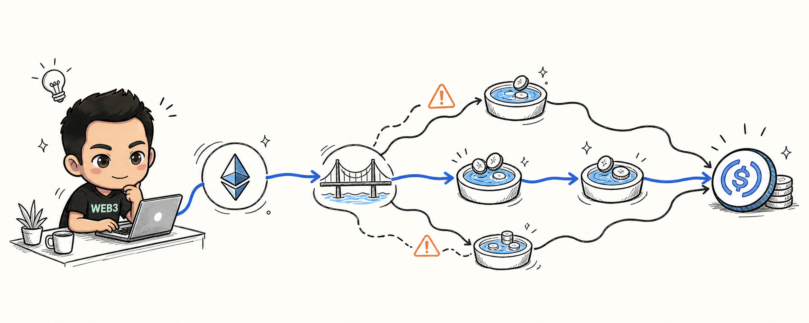
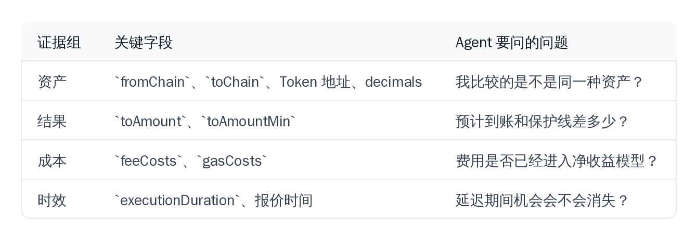
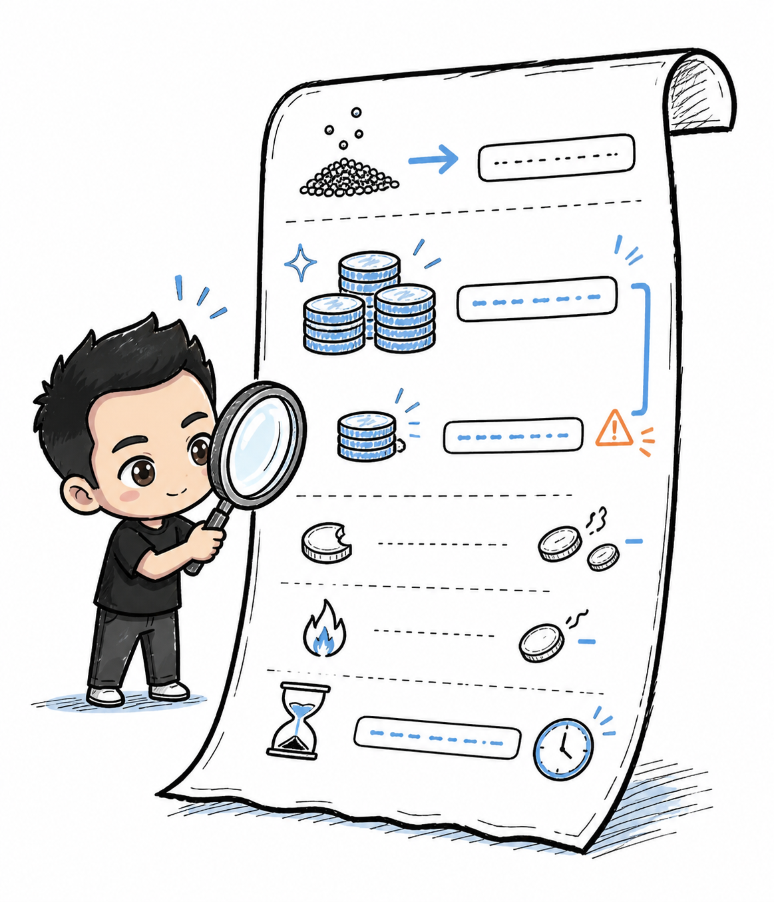
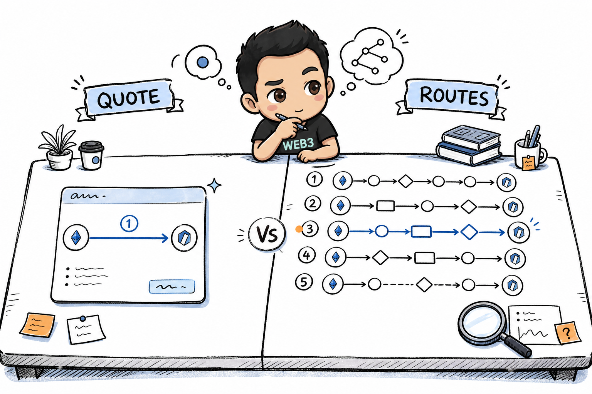

# 我先把一笔 LI.FI 报价拆开，再谈它能不能执行



链上套利共学 Day 5，我用程序只读地请求了一笔跨链报价。

我没有签名，也没有广播。先把返回值拆开，看清楚它到底告诉了我什么：资产身份、金额单位、候选路径、到账数量、保护线、费用、耗时，以及失败后可能留下的风险。

---

## 我先确认 LI.FI 到底负责什么

这次我把 LI.FI 当成路由和编排层，而不是策略引擎或收益保证器。它把跨链桥、DEX 和其他流动性方案放到统一接口后面，返回：

- 支持的链和 Token 查询；
- 单条 Quote；
- 多条候选 Routes；
- 费用和 Gas 拆解；
- 可供后续签名的交易数据；
- 交易提交后的状态查询。

剩下的判断不在 LI.FI 返回值里。我还得确认：

```text
这条路线是否满足资产约束？
扣除全部成本后是否仍然值得执行？
失败时是否会留下无法接受的单腿暴露？
```

对我来说，这些返回值只是执行前的证据，离“可以执行”还差几步。

---

## 我实际用到的读取链路

当前 Agent Skill 里的调用链可以压缩成 5 步：

```text
1. /chains   确认执行环境
2. /tokens   确认 Token 地址和 decimals
3. /quote    获取一条当前报价
4. /advanced/routes   需要比较时获取多条候选路线
5. /status   交易提交后查询实际状态
```

这 5 步不是每次都要全部调用。

`/chains`、`/tokens` 和 `/tools` 变化较慢，可以缓存；`/quote` 和 `/advanced/routes` 代表瞬时市场状态，不能长期复用旧结果；`/status` 只有拿到交易哈希或相关标识后才有意义。

静态发现数据可以缓存，动态报价不能当成长期有效的数据。

---

## 先把金额和资产身份核对清楚

本项目的 `demo2_quote_vs_routes.py` 和 `lifi-quote-collector.py` 都把人类可读金额转换成最小单位字符串。

这次实验输入是：

```text
0.1 ETH = 100000000000000000 wei
```

最小单位转换逻辑可以理解为：`from_amount = 人类可读金额 × 10^decimals`，最后以字符串传给 API。

真正容易出错的地方不是换算公式，而是 `decimals` 和资产身份从哪里来：

- ETH 通常是 18 位；
- USDC 通常是 6 位；
- 同名资产的不同链上表示也可能不是同一个 Token；
- `USDC` 与 `USDC.e` 不能只看符号判断为同一资产。

所以我不会只保存：

```text
symbol = USDC
```

还要一起保存：

```text
chainId + token address + decimals
```

资产身份错了，后面的报价比较就没有意义。

---

## 一条 `/quote` 先看哪些字段

我复用了项目里的脚本：

```bash
python3 lifi-demos/demo2-quote-routes/demo2_quote_vs_routes.py --amount 0.1
```

场景：

- 源链：Ethereum，Chain ID `1`
- 目标链：Arbitrum，Chain ID `42161`
- 输入：`0.1 ETH`
- 输出：Arbitrum USDC
- 地址：公开占位地址，仅用于报价

本次 `/quote` 返回：

```text
tool:              layerswap
预计到账:           191.033756 USDC
toAmountMin:       186.257912 USDC
预计耗时:           11 秒
```

费用拆解中还出现了：

```text
LI.FI Fixed Fee      ≈ $0.4791
LayerSwap Fee       ≈ $0.0384
gas(SEND)            ≈ $0.0624
```

如果只看 `toAmount`，结论会偏乐观。

我把字段分成四组：

【图片占位 IMG-04：Quote 证据字段对照表，请替换为 04-quote-evidence-table.png】



这张表先把报价拆成资产、结果、成本和时效四类证据。

【图片占位 IMG-02：LI.FI Quote 字段，请替换为 02-quote-fields.png】



`toAmountMin` 很容易被误读。

它是滑点保护下限，不是“实际一定会收到的数量”；`executionDuration` 是预计耗时，也不是完成证明。

这份报价只说明：

> 在请求时刻、给定金额、给定链和给定资产身份下，API 计算出了一个结果。

它不能证明未来一定成交，更不能证明套利盈利。

---

## 要比较路线，再调用 `/advanced/routes`

`/quote` 和 `/advanced/routes` 解决的是两个不同问题：

```text
/quote：给我一条当前可分析的最优报价
/advanced/routes：把候选路线列出来让我比较
```

本项目的 Routes 请求使用地址字段和链 ID：

```json
{
  "fromChainId": 1,
  "toChainId": 42161,
  "fromTokenAddress": "0x0000000000000000000000000000000000000000",
  "toTokenAddress": "0xaf88d065e77c8cC2239327C5EDb3A432268e5831",
  "fromAmount": "100000000000000000",
  "fromAddress": "0xYourAddress"
}
```

这次请求返回了 5 条候选路线：

```text
最高到账：191.130771 USDC
最低到账：190.038224 USDC
路线差异：约 1.092547 USDC
```

【图片占位 IMG-01：Quote 与 Routes 的区别，请替换为 01-quote-vs-routes.png】



这 `1.092547 USDC` 只是这次观察里不同路径的到账差异，不能直接当成利润。还缺少：

1. 目标市场的真实可成交价格和深度；
2. 到账后卖出或对冲的成本；
3. 延迟、失败和资金再平衡成本。

我不会直接选最高的数字，而是把每条路线整理成相同字段：

```text
route
fromAmount
estimatedToAmount
toAmountMin
feeCosts
gasCosts
executionDuration
steps
tool
```

只有放进统一的成本模型，这些路线数据才有比较价值。

---

## 我的执行前检查清单

在决定是否继续之前，我会检查 8 件事：

```text
1. 链 ID 是否正确？
2. Token 地址是否正确？
3. decimals 和最小单位金额是否正确？
4. toAmount 与 toAmountMin 的差距是否可接受？
5. feeCosts 和 gasCosts 是否完整？
6. executionDuration 是否引入明显延迟风险？
7. 目标市场是否存在真实可成交的退出路径？
8. 失败时是否有库存、对冲或再平衡方案？
```

有一项答不上来，我就不会把它标成“可执行套利”。

我会把它留在这个状态链上：

```text
报价观察
→ 待补充成本
→ 待验证流动性
→ 可执行候选
→ 模拟成交
→ 真实成交
```

中间的验证不能省略。

---

## 这套流程现在能做什么

当前项目只做只读研究：

- 查询支持的链、Token 和工具；
- 请求 Quote；
- 比较 Routes；
- 提取费用、Gas、耗时和最低到账；
- 把报价放入 Paper Trading 或净收益模型；
- 在已有交易哈希后查询 `/status`。

暂时不做这些事：

- 自动读取或保存私钥；
- 自动扩大 Token 授权；
- 自动签名；
- 自动广播；
- 把 `transactionRequest` 当作已成交交易；
- 用多个 Key 或多个 IP 绕过限流。

授权流程也不能偷懒：如果是 ERC-20，spender 要读取报价返回的 `estimate.approvalAddress`，不能硬编码。授权确认后还要重新报价，因为旧报价和 Gas 估算可能已经过期。

【图片占位 IMG-03：只读查询与签名广播边界，请替换为 03-read-only-boundary.png】


跨链执行还要处理状态差异：`PENDING` 不等于失败，`DONE` 还要继续看 `COMPLETED`、`PARTIAL` 或 `REFUNDED`，`FAILED` 则要根据失败原因决定是否停止。

API 返回交易数据，不等于资金已经按预期到达。两者之间的边界要保留。

---

## 这次我真正拿到的结果

我拿到的是一组可以重复请求的只读证据：

- `/quote` 返回 1 条当前报价；
- `/advanced/routes` 返回 5 条候选路线；
- 0.1 ETH 的候选路线到账差约 1.092547 USDC；
- 报价里包含最低到账、费用和预计耗时；
- 本地脚本能够重复请求并输出标准化字段。

同样没验证的有：

- 没有证明存在套利利润；
- 没有验证目标市场的真实成交深度；
- 没有验证跨链完成状态；
- 没有签名或广播交易；
- 没有产生真实交易结果。

所以，LI.FI 接入 Agent 的第一阶段，对我来说更像：

> 执行前证据采集。

先把证据补齐，比让 Agent 更快点击执行重要。证据不足时，正确的输出就是：

```text
这只是报价观察，暂时不能执行。
```

#Web3 #DeFi #LIFI #LearnInPublic

---

## 本文使用的本项目资料

- `lifi-demos/demo2-quote-routes/demo2_quote_vs_routes.py`
- `tools/lifi-quote-collector.py`
- `daily/2026-08-09.md` 的 Day 5 真实只读报价记录
- Hermes LI.FI Agent Skill 的接口、字段、状态和安全边界

证据性质：一次真实只读报价观察与本地脚本复现，不构成长期价格、可复制收益或真实盈利证明。
