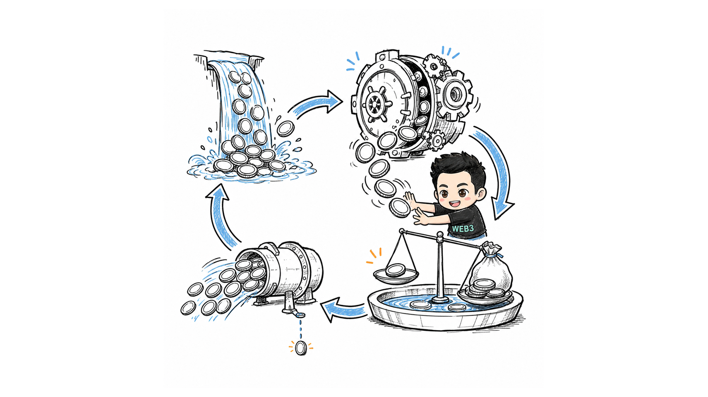
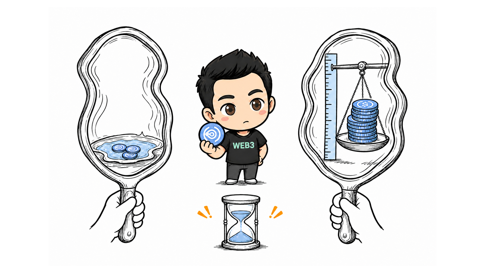
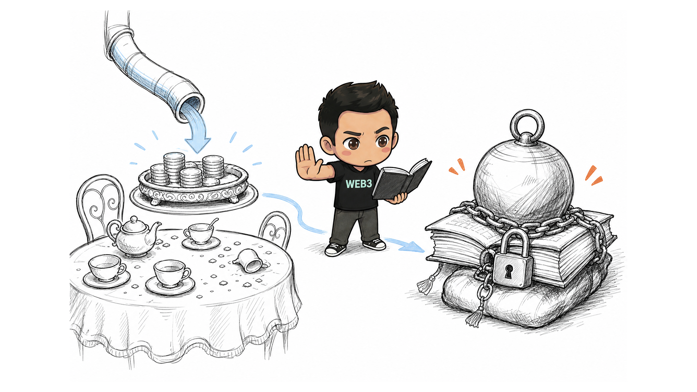

# 爱丽丝梦游仙境-打开闪电贷套利的梦幻世界(真实案例分析)

2026 年 8 月 15 日，我盯着一笔 Ethereum 主网交易看了很久。

它从 Morpho 借出 `27,722,557.767661 USDC`，最后转给发起地址的现金却只有 `166.666013 USDC`。

2,772 万进去，166.66 出来。

这组数字很像《爱丽丝梦游仙境》里的兔子洞：入口夸张得让人眩晕，洞底却不是一袋凭空出现的金币，而是一套彼此咬合的借贷、金库、价格、预言机和债务结构。

我把这笔真实交易逐层拆开后，才理解闪电贷套利最容易误导人的地方：看见巨额借款，不等于看见巨额利润；看见闪电贷已经归还，也不等于风险已经消失。

> 本文分析的是他人已经完成的历史交易，不是我的真实交易，不提供复刻代码，也不构成收益承诺。

目标交易：[Etherscan](https://etherscan.io/tx/0x82a206c9dff00bf7b205987bdcd9384c06c6d9962aa929c84ab45dd0330c4e72)

## 第一扇门：先认清仙境里的角色

我起初最大的障碍，不是计算，而是把所有合约都看成了一个模糊的「DeFi 池子」。实际上，这笔交易里至少有五类角色。

Morpho Blue 是借贷核心。它管理闪电贷、供应、抵押、借款和清算。不同借贷市场共用同一个核心合约，再由不同的 market ID 区分。

MetaMorpho 是金库层。用户存入 USDC，金库把资金分配到多个 Morpho market，存款人拿到代表资产份额的 vault share。

Kyber 和 Uniswap V4 才负责兑换。它们把 USDC 换成 sNUSD，Morpho 不负责这次现货交易。

执行器合约负责把所有动作串在同一笔交易里。它还创建了一个临时合约账户，用来承载交易结束后仍然存在的 sNUSD 抵押和 USDC 债务。

【图片占位 IMG-01：仙境角色地图，请替换为 01-wonderland-roles.png】

如果把它们混在一起，就会得到一句错误但很诱人的解释：「从 Morpho 买入 sNUSD，再用闪电贷套利。」

事实是：Morpho 负责借贷，DEX 负责买币，MetaMorpho 负责金库资产与份额，执行器负责原子编排。每一层解决的问题都不同。

## 第二扇门：2,772 万 USDC 从哪里来，又去了哪里

闪电贷先把 `27,722,557.767661 USDC` 交给执行器。它不要求预先抵押，但要求在同一笔交易结束前足额归还。少还本金或费用，整笔交易回滚。

执行器随后把 `27,720,847.840856 USDC` 存入 MetaMorpho，临时拿到金库绝大多数新增 share。金库再把这笔钱分配到三个 Morpho market，其中 `8,340,464.534694 USDC` 进入目标 sNUSD/USDC market。

这一步让我修正了一个重要误解。目标 market 在交易前利用率约为 100%，几乎没有闲置 USDC，但后续 MetaMorpho 的 834 万 USDC supply 已经提供了主要临时流动性。后面的 `1,000 USDC donation` 不是唯一的借款资金来源。

执行器又直接向目标 market supply `1,000 USDC`，并把 `onBehalf` 指向 MetaMorpho vault。这笔资产记到金库名下，却没有为 donation 提供者铸造新的 vault share。金库资产增加，share 数量没同步增加，单份 share 的价值因此略微上升。

执行器恰好已经用闪电贷成为临时大股东，所以它退出金库时能收回 donation 的大部分价值。

【图片占位 IMG-02：闪电贷资金兔子洞，请替换为 02-flashloan-rabbit-hole.png】

这也是闪电贷真正的作用：它不是利润来源，而是让执行器在一个交易内短暂拥有巨额资本和金库份额。

## 第三扇门：同一枚 sNUSD，在两面镜子里有两个价格

执行器通过 Kyber 和两个 Uniswap V4 池，用：

> `709.926805 USDC`

买到：

> `1,034.596985500417093984 sNUSD`

实际平均成交价约为 `0.68618681 USDC/sNUSD`。

接着，这批 sNUSD 被存入临时账户作为抵押品。历史复核资料显示，当时 Morpho oracle 对 sNUSD 的 NAV 估值约为 `1.0637953511 USDC`，目标 market 的 LLTV 为 `91.5%`。

换句话说，DEX 这面镜子说一枚 sNUSD 只值约 `0.6862 USDC`；借贷系统那面镜子则允许按更高的 NAV 估值乘以 LLTV 来借款。

最终，临时账户借出：

> `1,006.940350 USDC`

抵押品的买入成本与借款现金之间相差：

> `1,006.940350 - 709.926805 = 297.013545 USDC`

【图片占位 IMG-03：sNUSD 的两面镜子，请替换为 03-two-price-mirrors.png】

但这不是无风险的「低买高卖」。sNUSD 没有在交易里卖回 USDC。它被留在临时账户中，继续背着真实债务。

DEX 折价可能包含退出期限、赎回队列、NUSD 信用和流动性风险。NAV 是账面估值，不是随时都能无损成交的现货价格。

## 第四扇门：166.666013 USDC 到底怎么来的

金库赎回时，执行器拿回 `27,721,717.493324 USDC`。相对最初存入的 `27,720,847.840856 USDC`，多取回 `869.652468 USDC`。

因此，1,000 USDC donation 的真实成本不是 1,000：

> `1,000 - 869.652468 = 130.347532 USDC`

再把两部分放在一起：

> 抵押借款现金差：`297.013545 USDC`
>
> donation 净成本：`130.347532 USDC`
>
> 链上现金毛收益：`297.013545 - 130.347532 = 166.666013 USDC`

完整 USDC 现金流可以闭合为：

> `+27,722,557.767661` 闪电贷流入  
> `-27,720,847.840856` 存入 MetaMorpho  
> `-1,000.000000` direct donation  
> `-709.926805` 买入 sNUSD  
> `+1,006.940350` Morpho 普通借款  
> `+27,721,717.493324` 金库赎回  
> `-27,722,557.767661` 归还闪电贷  
> `=166.666013 USDC`

Etherscan 显示交易费为 `0.000227020318453654 ETH`，页面按当时价格估算约为 0.43 美元。按这个页面估值，现金净收益近似为 `166.236013 USDC`。

这里没有再扣一遍 swap 费用。实际输入与输出已经包含池费和价格影响，重复扣除会把同一成本算两次。

## 第五扇门：闪电贷归零，债务没有归零

这笔交易最像仙境的地方，是账面在交易结束时同时出现了两种状态：闪电贷已经全部归还，但临时账户仍然持有：

> `1,034.5969855 sNUSD` 抵押品  
> `1,006.940350 USDC` 债务

临时账户只是债务的容器，不是债务消失器。

按历史 NAV 估值计算，这个账户当时还有约 `93.6591 USDC` 的 NAV 口径净权益。如果 sNUSD 最终能按足够高的 NAV 兑现，那么已实现现金加未实现权益约为 `260.3251 USDC`。

但 `260.3251 USDC` 不是已经落袋的利润，更不是数学上的单次利润上限。它依赖 sNUSD 的最终赎回、时间成本、清算价格和债务处理。

【图片占位 IMG-04：茶会结束后的账单，请替换为 04-after-party-debt.png】

如果抵押品最终不足以偿债，缺口可能成为 Morpho market 的坏账，并传导给 lender；MetaMorpho 是供应方之一，风险还可能继续影响 vault 存款人的 share 价值。

反过来，如果 sNUSD 能按 NAV 足额兑现，这笔交易更像带期限和赎回风险的结构性折价套利，而不是已经被证明的攻击。

一笔交易只能证明它在当时的状态和参数下执行成功，不能替我们回答后续所有经济结果。

## 走出兔子洞：我真正学会了什么

我现在不会再用「借了 2,772 万，赚了 166 美元」概括这笔交易。这个说法数字没错，机制却几乎全丢了。

更准确的描述是：

> sNUSD 的 DEX 折价  
> + Morpho oracle 与 LLTV 提供的借款能力  
> + MetaMorpho donation 的成本回收  
> + 闪电贷提供的临时资本与金库份额  
> + 交易后仍然存续的抵押和债务头寸

这条路径能否扩大，也不能只看闪电贷额度。增加买入量会改变 DEX 滑点，增加借款要受 oracle、LLTV 和 market 流动性限制，扩大金库建仓会改变 share 占比和 donation 回收率。Gas、MEV、失败成本和清算风险也会跟着变化。

真正需要比较的是：

> 边际借款收益，是否仍然高于边际买入成本、滑点、未回收 donation、Gas 和风险成本。

今天我没有执行真实交易。我做的是一笔历史交易的只读复盘，并确认了一个以后会反复使用的判断框架：先分清现金、头寸、协议状态和风险，再谈利润。

仙境可以很梦幻，账本不会。

## 证据与来源

- [目标交易：Ethereum 主网 Etherscan](https://etherscan.io/tx/0x82a206c9dff00bf7b205987bdcd9384c06c6d9962aa929c84ab45dd0330c4e72)
- [Morpho 官方文档：Flash Loans](https://docs.morpho.org/learn/concepts/flashloans)
- [Morpho 官方文档：Vault Curator Security Considerations](https://docs.morpho.org/curate/concepts/security-considerations)
- [MetaMorpho v1.1 源码仓库](https://github.com/morpho-org/metamorpho-v1.1)

证据边界：交易日志、转账、Gas、market ID 和最终 sweep 来自公开交易页面；LLTV、历史 oracle NAV 和交易前利用率来自高可信外部历史复核，当前项目尚未保存完整 RPC JSON。`166.666013 USDC` 是链上转给 EOA 的现金，不等于最终经济利润。本文不代表本人完成了真实交易。
